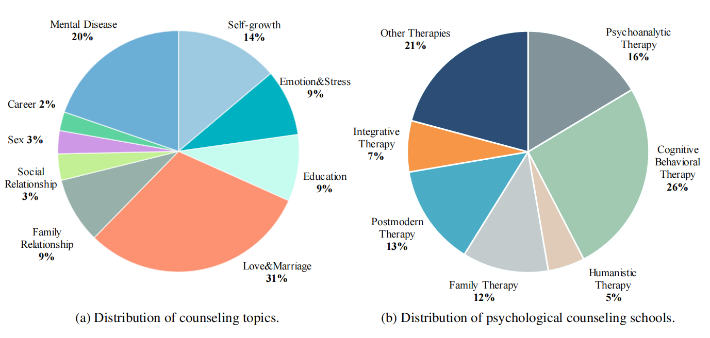

# CPsyCounD

The high-quality multi-turn dialogue dataset, which has a total of **3,134 multi-turn consultation dialogues**. CPsyCounD covers **nine representative topics** and **seven classic schools** of psychological counseling.

## Data analysis

 ### Topic types
 * Self-growth
 * Emotion&Stress
 * Education
 * Love&Marriage
 * Family Relationship
 * Social Relationship
 * Sex
 * Career
 * Mental Disease

### Consulting schools
* Psychoanalytic Therapy
* Cognitive Behavioral Therapy
* Humanistic Therapy
* Family Therapy
* Postmodern Therapy
* Integrative Therapy
* Other Therapies (Mindfulness/Morita therapy...)
