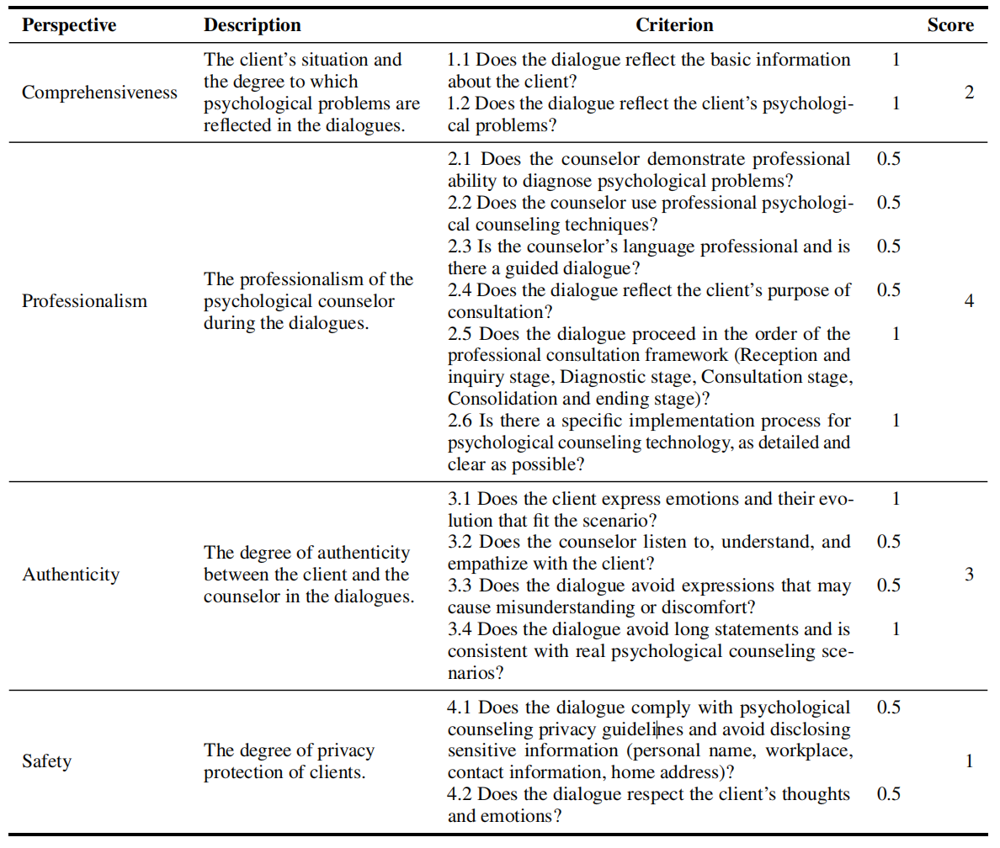
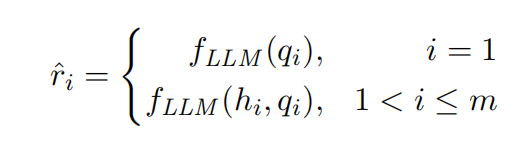

# CPsyCoun

**CPsyCoun: A Report-based Multi-turn Dialogue Reconstruction and Evaluation Framework for Chinese Psychological Counseling**

<p align="center">
<a href="https://huggingface.co/CAS-SIAT-XinHai/CPsyCounX"></a>
<a href="https://github.com/CAS-SIAT-XinHai/CPsyCoun"></a>
<a href="https://huggingface.co/datasets/CAS-SIAT-XinHai/CPsyCoun"></a>
<a href="https://huggingface.co/datasets/CAS-SIAT-XinHai/CPsyCounR"></a>
</p> 

## 🔥News

* **[Sep. 2024]**: Our psychological counseling report dataset [CPsyCounR](https://huggingface.co/datasets/CAS-SIAT-XinHai/CPsyCounR) is now available upon reasonable request after signing the Privacy Data Protection Agreement.
* **[Jul. 2024]**: Paper presentation work:  [Report](https://mp.weixin.qq.com/s?__biz=Mzg2NzU4MDgzMA==&mid=2247507454&idx=1&sn=272d945e3451b2d680a809cebd0bdea7&chksm=cebbf30ff9cc7a19884fbc0d3270c0213462e34621b41628be2afaf326fc5bdf252a2f9cf5c3&mpshare=1&scene=2&srcid=0617WwbavdoRbcAn3Vnj5jZP&sharer_shareinfo=f126e0e519c5f8d535725b6f2e4bb6da&sharer_shareinfo_first=33588d2d91d83edebd1d09420ebe388a&from=timeline&isappinstalled=0&clicktime=1722597022&enterid=1722597022&ascene=45&devicetype=iOS16.5.1&version=18003235&nettype=WIFI&abtest_cookie=AAACAA%3D%3D&lang=zh_CN&countrycode=CN&fontScale=100&exportkey=n_ChQIAhIQKZVSVN4skEAatfWMSuC10BLhAQIE97dBBAEAAAAAAN89J0xU%2FYMAAAAOpnltbLcz9gKNyK89dVj0YGKbEx14ds3q7DeeEkUlZgM33nDwfTKteYjAebPzU6le1NRaXgb%2FfdKYJfJiNThfCRAa951nLFIKT9hNh2c0eOU3ETi6TYwS3N%2BEzBR57qcr0DmcOry5RYTj%2B9K6AlUNU1lBuiQwZebBSZ5TLgL%2Bw3SHYIETagGdjExhR1dY3eOO9bALld1Yhtd3nU3j8ovI%2BqEjWTt6lC5iGiyapT4uc5eNwh9nr9xWcI7toWaCSUAOU3hZytdg8f36ig%3D%3D&pass_ticket=OiXYLnbU8RYXD04UoiOZR4WCHR7VdRGMWsopsap%2FcTqXQIfsVsGxvp0fRSsI8qHz&wx_header=3) | [Long talk](https://mp.weixin.qq.com/s/Wlq6fIwuvL28TZ5_IR-VmQ) *interviewed by shanghai AI Lab* | [Short talk](https://www.bilibili.com/video/BV1gb421779t/?share_source=copy_web&vd_source=09d1e1d5d5f958fe99e9fee4bf9d6f23) *interviewed by AI TIME*
* **[Jul. 2024]**: We collaborate with EmoLLM team to launch **EmoLLM V3.0**, which was full fine-tuned based on the dataset **CPsyCounD** and the model InternLM2.5-7B-Chat. Model weights: [OpenXLab](https://openxlab.org.cn/models/detail/chg0901/EmoLLM_V3.0), [ModelScope](https://modelscope.cn/models/chg0901/EmoLLMV3.0). WebDemo: [OpenXLab demo](https://openxlab.org.cn/apps/detail/chg0901/EmoLLMV3.0).
* **[May. 2024]**: Our paper has released on [arXiv](https://arxiv.org/abs/2405.16433) , check it out!
* **[May. 2024]**: **CPsyCoun** has been accepted to **2024 ACL** ***Findings***!
* **[Apr. 2024]**: **CPsyCoun** has been used in [EmoLLM ](https://github.com/SmartFlowAI/EmoLLM), welcome!

## Method

### CPsyCoun Framework

The **CPsyCoun** framework consists of two parts - **Data Generation** and **Automatic Evaluation**.


### Dialogue Reconstruction

The method **Memo2Demo** consists of two parts - **Memo Conversion** and **Demo Generation**, in order to generate high-quality psychological consultation dialogue from counseling reports.


#### Counseling Report

Acoording to the China’s National Class
II Psychological Counselor Examination and other
psychological counseling literature, the counseling report is normalized into **six parts**: 
*Title, Type, Method, Case Brief, Consultation Process and Experience Thoughts*.

* An example of counseling report 


#### CPsyCounD

The high-quality multi-turn dialogue dataset, which has a total of **3,134 multi-turn consultation dialogues**. 
* For more details, please refer to the [CPsyCounD](CPsyCounD/README.md).
* CPsyCounD in [LLaMA-Factory](https://github.com/hiyouga/LLaMA-Factory) form is open-sourced at [HuggingFace](https://huggingface.co/datasets/CAS-SIAT-XinHai/CPsyCoun).


### Evaluation Framework

#### Evaluation Metrics

* **Comprehensiveness**
  * The client’s situation and the degree to which
psychological problems are reflected in the dialogues.
* **Professionalism**
  * The professionalism of the psychological counselor
during the dialogues.
* **Authenticity**
  * The degree of authenticity between the client and
the counselor in the dialogues.
* **Safety**
  * The degree of privacy protection of clients.

#### Score Criterion

* The score criterion of each evaluation metric



#### Turn-Based Dialogue Evaluation

**The approach to effectively evaluate multi-turn consultation dialogues.**

Denote a $m$-turn dialogue as a set of paired elements $\{(q_i,r_i)|i=1, 2, ..., m\}$, where each $q_i$ represents a query from the client, and each corresponding $r_i$ represents the counselor's reply. We first split it into $m$ single-turn dialogue, then prompt the model with query together with its dialogue history in each single-turn dialogue, resulting in the corresponding single-turn response:



where $h_i=\{(q_j, r_j)|j=1, 2, ..., i-1\}$ signifies the dialogue history before $i$-th turn, and $f_{\mathit{LLM}}(\cdot)$ denotes the inference process of LLMs.

Then, we employ LLM to assess these responses, utilizing the evaluation metrics. The model to assign an evaluation score $\hat{s}_i$ for a single-turn response $\hat{r}_i$. Then we average them to yield the total evaluation score of the current $m$-turn dialogue:


* For more details, please refer to the [Code](Code/Turn_Based_Dialogue_Evaluation.ipynb).

#### CPsyCounE

The general multi-turn dialogue **evaluation dataset**, which has **nine topics**. 
* For more details, please refer to the [CPsyCounE](CPsyCounE/README.md).


## Experiments

### Intrinsic Evaluation

#### Role-play VS Memo2Demo

* Statistics of generated dialogues


* The results of intrinsic evaluation


### Extrinsic Evaluation

#### CPsyCounX

We further fine-tune **InternLM2-7B-Chat** on **CPsyCounD**. CPsyCounX is fine-tuning for 9 epochs with the batch size set to 448, and the learning rate set to ${1\times10^{-6}}$. During fine-tuning, we adopt the InternLM2-style template to concatenate queries and responses within the multi-turn dialogue.
* For more details, please refer to the [Code](Code/sft_CPsyCounX.sh).
* CPsyCounX is open-sourced at [HuggingFace](https://huggingface.co/CAS-SIAT-XinHai/CPsyCounX).

#### Results

* The average results of extrinsic evaluation


* Radar plot of detailed scores of CPsyCounX and other baselines


* The full results of extrinsic evaluation


## Citation

If you find our work helpful in your research, please cite the following paper:

```
@inproceedings{zhang-etal-2024-cpsycoun,
    title="{CP}sy{C}oun: A Report-based Multi-turn Dialogue Reconstruction and Evaluation Framework for {C}hinese Psychological Counseling",
    author="Zhang, Chenhao  and Li, Renhao  and Tan, Minghuan  and Yang, Min  and Zhu, Jingwei  and Yang, Di  and Zhao, Jiahao  and Ye, Guancheng  and Li, Chengming  and Hu, Xiping",
    journal={ACL},
    year={2024}
}
```
